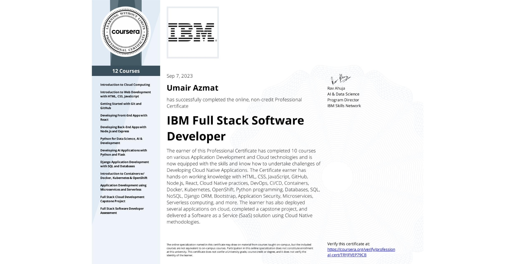

<h1>IBM Full Stack Software Developer Professional Certificate</h1>
		
This repository contains the solutions to practice questions and quizzes, as well as a summary of lessons from the IBM Full Stack Software Developer Professional Certificate program. The program equips you with key skills and technical know-how to kickstart your career as a Full-Stack Cloud Native Application Developer, guided by IBM. You will learn to build your own cloud-based applications and work with the technologies behind them. The program consists of 10 courses with ample instructional content as well as hands-on exercises and projects designed to hone your skills and help you build your portfolio.

<h1>IBM Full Stack Software Developer</h1>

<h2>About the Program</h2>
		
No prior programming experience or Cloud background is required to start this program. You'll skill up with the tools and technologies that successful software developers use to build, deploy, test, run, and manage Full Stack Cloud Native applications, giving you the practical skills to begin a new career in an in-demand area.

		
The courses in this program will help you develop skill sets in many technologies including: Cloud foundations, HTML, CSS, JavaScript, GitHub, Node.js, React, Cloud Native practices, DevOps, CI/CD, Containers, Docker, Kubernetes, OpenShift, Istio, Python, Databases, SQL, NoSQL, Django ORM, Bootstrap, Application Security, Microservices, Serverless computing, and more.

		
After completing all the courses in the program, including the capstone project, you will have developed several applications using front-end and back-end technologies and deployed them on a cloud platform using Cloud Native methodologies. Additionally, this program is ACE® recommended—when you complete, you can earn college credits.

    
			
		
		
